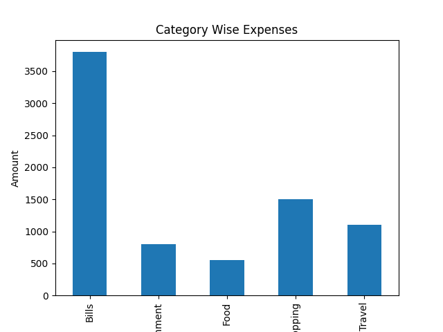
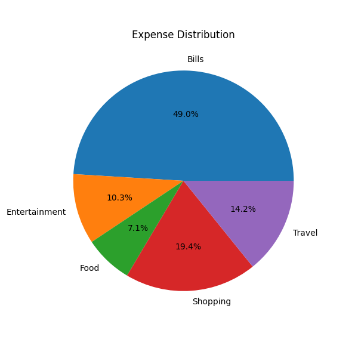

# Personal Finance Analytics System

## Overview
The Personal Finance Analytics System is a data analytics project developed using Python, Pandas, and Matplotlib. The project analyzes personal finance transactions to provide insights into income, expenses, savings, and spending patterns.

## Features
- Income Analysis
- Expense Analysis
- Savings Calculation
- Savings Rate Analysis
- Category-wise Expense Analysis
- Data Visualization using Bar Charts
- Expense Distribution using Pie Charts

## Technologies Used
- Python
- Pandas
- Matplotlib
- CSV Data Processing
- Git & GitHub

## Project Structure

```text
Personal-Finance-Analytics-System
│
├── data
│   ├── finance_data.csv
│   └── notebook
│       └── finance_analysis.py
│
├── bar_chart.png
├── expense_distribution.png
└── README.md
```

## Key Insights
- Calculated total income and expenses.
- Determined savings and savings rate.
- Identified major spending categories.
- Visualized financial data for better decision-making.

## Visualizations

### Category Wise Expense Analysis


### Expense Distribution


## Author

**SelvaKumar D**  
BCA Student | Aspiring Data Analyst

## GitHub Repository

Personal Finance Analytics System - Data Analytics Project
